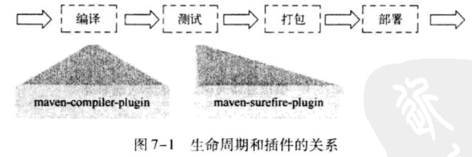
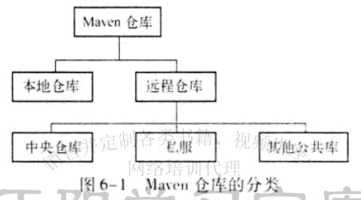
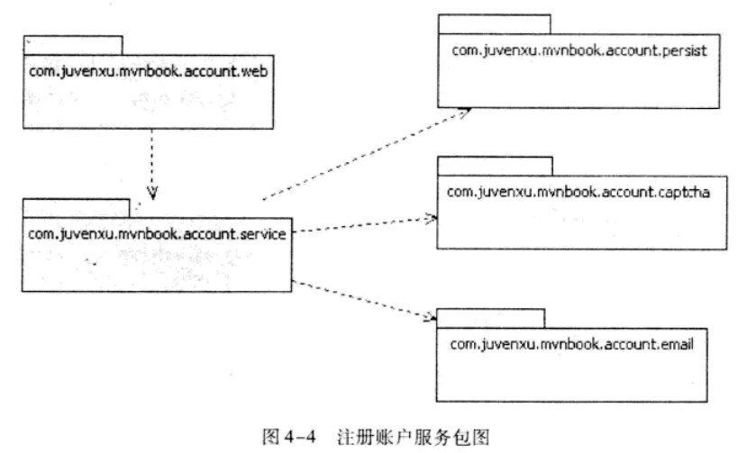
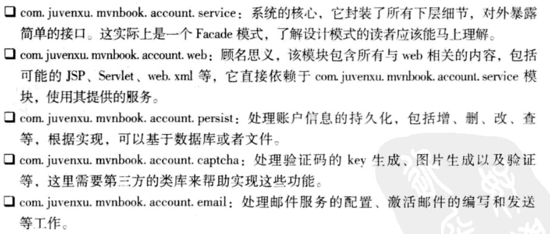

learn maven
==========

maven小组学习

- 生命周期和插件
	- maven的生命周期是抽象的，其实际行为由插件来完成
	- maven生命周期对所有构建过程进行了抽象和统一
	- 
	- 三个阶段
		- clean：清理项目
		- default：构建项目
		- site：建立项目站点

- 使用Archetype生成项目骨架
	- mvn archetype:generate

- 背景案例

- maven坐标与依赖
	- groupId
	- artifactId
	- version
	- packaging
	- classifier
	- scope依赖的范围
		- compile
		- test
		- provided
		
- 仓库

- 聚合和继承

- 背景案例

